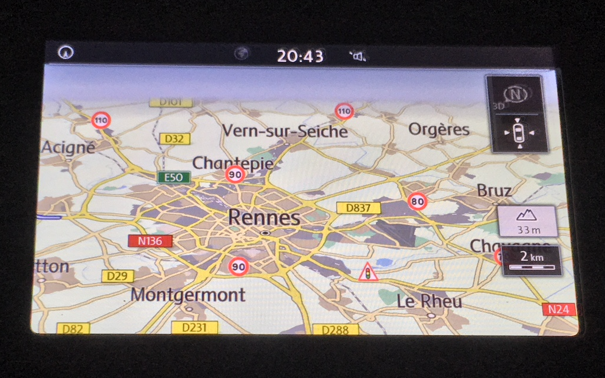

# Open GATSO POI

* Latest version: **<!-- [VERSION[ -->2018-07-11T12:33:18.000Z<!-- ]VERSION] -->**
* Number of POIs: **<!-- [AMOUNT[ -->26538<!-- ]AMOUNT] -->**



Daily it gives the latest set of speed cameras on the EU.

<!-- [MATRIX[ --><table><thead><tr><td></td><th>BE</th><th>CH</th><th>DE</th><th>ES</th><th>FR</th><th>GB</th><th>IT</th><th>LU</th><th>NL</th><th>PL</th><th>PT</th><th>SE</th><td></td></tr></thead><tbody><tr><th>!30</th><td>✔︎</td><td>✔︎</td><td>✔︎</td><td></td><td>✔︎</td><td>✔︎</td><td>✔︎</td><td></td><td>✔︎</td><td>✔︎</td><td>✔︎</td><td>✔︎</td><th>2968</th></tr><tr><th>!40</th><td></td><td>✔︎</td><td>✔︎</td><td>✔︎</td><td></td><td>✔︎</td><td>✔︎</td><td></td><td>✔︎</td><td>✔︎</td><td></td><td>✔︎</td><th>997</th></tr><tr><th>!50</th><td>✔︎</td><td>✔︎</td><td>✔︎</td><td>✔︎</td><td>✔︎</td><td>✔︎</td><td>✔︎</td><td></td><td>✔︎</td><td>✔︎</td><td>✔︎</td><td>✔︎</td><th>6472</th></tr><tr><th>!60</th><td>✔︎</td><td>✔︎</td><td>✔︎</td><td>✔︎</td><td></td><td>✔︎</td><td>✔︎</td><td></td><td>✔︎</td><td>✔︎</td><td>✔︎</td><td>✔︎</td><th>734</th></tr><tr><th>!70</th><td>✔︎</td><td>✔︎</td><td>✔︎</td><td>✔︎</td><td>✔︎</td><td>✔︎</td><td>✔︎</td><td>✔︎</td><td>✔︎</td><td>✔︎</td><td>✔︎</td><td>✔︎</td><th>2769</th></tr><tr><th>!80</th><td>✔︎</td><td>✔︎</td><td>✔︎</td><td>✔︎</td><td>✔︎</td><td>✔︎</td><td>✔︎</td><td></td><td>✔︎</td><td>✔︎</td><td>✔︎</td><td>✔︎</td><th>2408</th></tr><tr><th>!90</th><td>✔︎</td><td></td><td>✔︎</td><td>✔︎</td><td>✔︎</td><td></td><td>✔︎</td><td>✔︎</td><td>✔︎</td><td>✔︎</td><td>✔︎</td><td>✔︎</td><th>1543</th></tr><tr><th>!100</th><td>✔︎</td><td>✔︎</td><td>✔︎</td><td>✔︎</td><td></td><td>✔︎</td><td>✔︎</td><td></td><td>✔︎</td><td>✔︎</td><td>✔︎</td><td>✔︎</td><th>621</th></tr><tr><th>!110</th><td></td><td></td><td>✔︎</td><td></td><td>✔︎</td><td></td><td>✔︎</td><td></td><td>✔︎</td><td></td><td></td><td>✔︎</td><th>299</th></tr><tr><th>!120</th><td>✔︎</td><td>✔︎</td><td>✔︎</td><td>✔︎</td><td></td><td>✔︎</td><td></td><td></td><td>✔︎</td><td></td><td>✔︎</td><td></td><th>512</th></tr><tr><th>!130</th><td></td><td></td><td></td><td></td><td>✔︎</td><td></td><td>✔︎</td><td></td><td></td><td></td><td></td><td></td><th>215</th></tr><tr><th>!stop</th><td>✔︎</td><td>✔︎</td><td>✔︎</td><td>✔︎</td><td>✔︎</td><td>✔︎</td><td>✔︎</td><td></td><td>✔︎</td><td></td><td></td><td></td><th>6767</th></tr><tr><th>!rail</th><td></td><td></td><td></td><td></td><td>✔︎</td><td></td><td></td><td></td><td></td><td></td><td></td><td></td><th>78</th></tr><tr><th>!tunnel</th><td></td><td>✔︎</td><td>✔︎</td><td>✔︎</td><td></td><td></td><td></td><td></td><td></td><td></td><td></td><td></td><th>155</th></tr></tbody><thead><tr><td></td><th>24794</th><th>24403</th><th>26245</th><th>22978</th><th>23519</th><th>24248</th><th>25793</th><th>4312</th><th>26090</th><th>18512</th><th>18027</th><th>18811</th><td></td></tr></thead></table><!-- ]MATRIX] -->

* GPX (accurate)
    - Garmin (embeded into VolksWagen, MAN, Skoda, Seat, etc.)
    - Mercedes
    - Volvo
* CSV (verbose): 
    - Garmin (embeded into VolksWagen, MAN, Skoda, Seat, etc.)
    - Navman
* OV2 (minimalist):
    - TomTom (embeded into Fiat, Peugeot, etc.)


## installation


3 methods:

1. Quick (on SD Card)
    - download the lastest [⤓](https://github.com/1e1/Garmin-Open-GATSO/releases/download/travis_master/sd_image.iso.zip)`sd_image.iso.zip` from the [releases page](https://github.com/1e1/Garmin-Open-GATSO/releases)
    - unzip it
    - burn it on a SD Card
    - insert the SD Card in your GPS
    - you should manually import the POI (see [howto for VW](#explanations)) 

2. Official on SD Card
    - download the lastest [⤓](https://github.com/1e1/Garmin-Open-GATSO/releases/download/travis_master/all_files.zip)`all_files.zip` from the [releases page](https://github.com/1e1/Garmin-Open-GATSO/releases)
    - unzip it
    - download [Garmin POI Loader](https://www8.garmin.com/support/collection.jsp?product=999-99999-12)
    - run Garmin POI Loader and let the wizard lead you
    - insert the SD Card in your GPS
    - you should manually import the POI (see [howto for VW](#explanations)) 

3. Official online
    - download the lastest [⤓](https://github.com/1e1/Garmin-Open-GATSO/releases/download/travis_master/all_files.zip)`all_files.zip` from the [releases page](https://github.com/1e1/Garmin-Open-GATSO/releases)
    - unzip it
    - go to the website of your car maker (eg VW: https://www.volkswagen-car-net.com) (please, contact me for others links)
    - upload every CSV as new POIs
    - connect your car to the Internet
    - update your GPS


## DIY usage

### first run

```bash
# git clone ...
cd ./src
npm install
# export only csv and gpx
node ./build.js csv gpx
```

### batch 

require [cdrtools](http://cdrtools.sourceforge.net/private/cdrecord.html) and [mypois](https://github.com/jimmyH/mypois)

```bash
# get latest GATSO
node ./src/build.js csv
# append headers to CSV
./make_mypois.sh
# make SD_CARD structure
python ./mypois-master/mypois.py ./config.ini
# create disk image
mkisofs -o sd_image.iso SD_CARD
# archive it
zip -r sd_image.iso.zip sd_image.iso
```


## documentation

### Speed Camera
REST service from:
* https://radars.securite-routiere.gouv.fr/
* https://lufop.net/zones-de-danger-france-et-europe-asc-et-csv/

### GFX tool
* draw icons 24x24 icons on https://www.piskelapp.com/
* export as animated GIF 
* get every frame: `$ convert -coalesce ./src/assets/New\ Piskel.gif  frame_%02d.bmp`

### CSV structure
* https://www8.garmin.com/products/poiloader/creating-custom-poi-files/ <- best doc! 
* http://www.poi-factory.com/garmin-csv-file-format
* https://www.poieditor.com/poi_convert/garmin-csv-to-ov2/

### Gamin POI Loader
* https://www8.garmin.com/support/collection.jsp?product=999-99999-12
* save image: `dd if=/dev/disk2 of=./sd_image.img`

### TomTom POI ov2
* https://www.tomtom.com/lib/doc/ttnavsdk3_manual.pdf

### explanations

#### VW Discover Media

> - press the **NAV** button
> - insert the SD Card into the second card connector of your GPS
> - select *Configuration*
> - select *Gérer la mémoire*
> - select *Mise à jour my POI*
> - waiting for *Logiciel de mise à jour disponible* then press *mise à jour* then press *suivant*
> - while it terminated, press the **NAV** button
> - select *Carte*
> - select *Afficher les POI*
> - select *Afficher les catégories*
> - scroll down to GATSO and check which POI you want
> - enjoy

#### others

[SpeedCamUpdates](http://www.speedcamupdates.fr) helps for a lot of configurations

---

