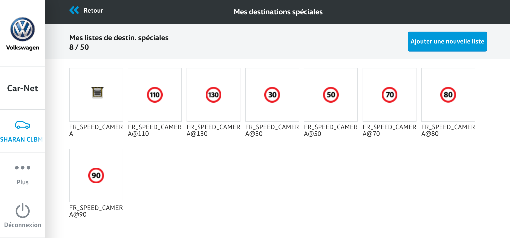

# Garmin Open GATSO

It aims Garmin GPS like them into VolksWagen, MAN, Skoda, Seat, etc. 


## installation


3 methods:

1. Copy SD_CARD
    - download the lastest release [on this page](https://github.com/1e1/Garmin-Open-GATSO/releases)
    - unzip it
    - burn it on a SD Card
    - insert the SD Card in your GPS

2. Run POILoader to copy SD_CARD on a SD Card
    - download [Garmin POI Loader](https://www8.garmin.com/support/collection.jsp?product=999-99999-12)
    - copy all files from [this directory](./SD_CARD) into a local directory
    - run Garmin POI Loader and let the wizard lead you
    - insert the SD Card in your GPS

3. Go to website of your car (VW: Carnet) and add manually new POI
    - copy all files from [this directory](./SD_CARD) into a local directory
    - go to the website of your car maker
    - upload the files as new POIs
    - connect your car to the Internet
    - update your GPS


## usage

```bash
# git clone ...
npm install
ls ./src
./src/index_fr.js
```


## documentation

### FR Speed Camera
REST service from:
* https://radars.securite-routiere.gouv.fr/radars/all?_format=json
* https://radars.securite-routiere.gouv.fr/radars/{id}?_format=json

### GFX tool
* draw icons 24x24 icons on https://www.piskelapp.com/
* export as animated GIF 
* get every frame: `$ convert -coalesce ./src/assets/New\ Piskel.gif  frame_%02d.bmp`

### CSV structure
* https://www8.garmin.com/products/poiloader/creating-custom-poi-files/ <- best doc! 
* http://www.poi-factory.com/garmin-csv-file-format

### Gamin POI Loader
* https://www8.garmin.com/support/collection.jsp?product=999-99999-12
* save image: `dd if=/dev/disk2 of=./sd_image.img`

