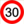
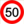
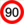
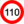
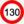

# Open GATSO POI

* Number of POIs: **<!-- [AMOUNT[ -->141493<!-- ]AMOUNT] -->** @ **<!-- [VERSION[ -->2018-08-27<!-- ]VERSION] -->**
* Get the latest build on the [website](https://1e1.github.io/Open-GATSO-POI/)


Daily it gives the latest set of speed cameras on the EU.

<!-- [X_COUNTRY[ --><table><thead><tr><td></td><th><span>BE</span></th><th><span>CH</span></th><th><span>DE</span></th><th><span>ES</span></th><th><span>FR</span></th><th><span>GB</span></th><th><span>IT</span></th><th><span>LU</span></th><th><span>NL</span></th><th><span>PL</span></th><th><span>PT</span></th><th><span>SE</span></th><td></td></tr></thead><tbody><tr><th nowrap> 30</th><td>✔︎</td><td>✔︎</td><td>✔︎</td><td></td><td>✔︎</td><td>✔︎</td><td>✔︎</td><td></td><td>✔︎</td><td>✔︎</td><td>✔︎</td><td>✔︎</td><th>2969</th></tr><tr><th nowrap> 40</th><td></td><td>✔︎</td><td>✔︎</td><td>✔︎</td><td></td><td>✔︎</td><td>✔︎</td><td></td><td>✔︎</td><td>✔︎</td><td></td><td>✔︎</td><th>997</th></tr><tr><th nowrap> 50</th><td>✔︎</td><td>✔︎</td><td>✔︎</td><td>✔︎</td><td>✔︎</td><td>✔︎</td><td>✔︎</td><td></td><td>✔︎</td><td>✔︎</td><td>✔︎</td><td>✔︎</td><th>6476</th></tr><tr><th nowrap> 60</th><td>✔︎</td><td>✔︎</td><td>✔︎</td><td>✔︎</td><td></td><td>✔︎</td><td>✔︎</td><td></td><td>✔︎</td><td>✔︎</td><td>✔︎</td><td>✔︎</td><th>735</th></tr><tr><th nowrap> 70</th><td>✔︎</td><td>✔︎</td><td>✔︎</td><td>✔︎</td><td>✔︎</td><td>✔︎</td><td>✔︎</td><td>✔︎</td><td>✔︎</td><td>✔︎</td><td>✔︎</td><td>✔︎</td><th>2768</th></tr><tr><th nowrap> 80</th><td>✔︎</td><td>✔︎</td><td>✔︎</td><td>✔︎</td><td>✔︎</td><td>✔︎</td><td>✔︎</td><td></td><td>✔︎</td><td>✔︎</td><td>✔︎</td><td>✔︎</td><th>2409</th></tr><tr><th nowrap> 90</th><td>✔︎</td><td></td><td>✔︎</td><td>✔︎</td><td>✔︎</td><td></td><td>✔︎</td><td>✔︎</td><td>✔︎</td><td>✔︎</td><td>✔︎</td><td>✔︎</td><th>1543</th></tr><tr><th nowrap> 100</th><td>✔︎</td><td>✔︎</td><td>✔︎</td><td>✔︎</td><td></td><td>✔︎</td><td>✔︎</td><td></td><td>✔︎</td><td>✔︎</td><td>✔︎</td><td>✔︎</td><th>621</th></tr><tr><th nowrap> 110</th><td></td><td></td><td>✔︎</td><td></td><td>✔︎</td><td></td><td>✔︎</td><td></td><td>✔︎</td><td></td><td></td><td>✔︎</td><th>299</th></tr><tr><th nowrap> 120</th><td>✔︎</td><td>✔︎</td><td>✔︎</td><td>✔︎</td><td></td><td>✔︎</td><td></td><td></td><td>✔︎</td><td></td><td>✔︎</td><td></td><th>513</th></tr><tr><th nowrap> 130</th><td></td><td></td><td></td><td></td><td>✔︎</td><td></td><td>✔︎</td><td></td><td></td><td></td><td></td><td></td><th>215</th></tr><tr><th nowrap> GATSO</th><td>✔︎</td><td>✔︎</td><td>✔︎</td><td>✔︎</td><td>✔︎</td><td>✔︎</td><td>✔︎</td><td>✔︎</td><td>✔︎</td><td>✔︎</td><td>✔︎</td><td>✔︎</td><th>26621</th></tr><tr><th nowrap> unknown</th><td></td><td></td><td></td><td></td><td>✔︎</td><td></td><td></td><td></td><td></td><td></td><td></td><td></td><th>76</th></tr><tr><th nowrap> speed</th><td>✔︎</td><td>✔︎</td><td>✔︎</td><td>✔︎</td><td>✔︎</td><td>✔︎</td><td>✔︎</td><td>✔︎</td><td>✔︎</td><td>✔︎</td><td>✔︎</td><td>✔︎</td><th>19700</th></tr><tr><th nowrap> stop</th><td>✔︎</td><td>✔︎</td><td>✔︎</td><td>✔︎</td><td>✔︎</td><td>✔︎</td><td>✔︎</td><td></td><td>✔︎</td><td></td><td></td><td></td><th>6845</th></tr><tr><th nowrap> redlight</th><td>✔︎</td><td>✔︎</td><td>✔︎</td><td>✔︎</td><td>✔︎</td><td>✔︎</td><td>✔︎</td><td></td><td>✔︎</td><td></td><td></td><td></td><th>6767</th></tr><tr><th nowrap> railway</th><td></td><td></td><td></td><td></td><td>✔︎</td><td></td><td></td><td></td><td></td><td></td><td></td><td></td><th>78</th></tr><tr><th nowrap> tunnel</th><td></td><td>✔︎</td><td>✔︎</td><td>✔︎</td><td></td><td></td><td></td><td></td><td></td><td></td><td></td><td></td><th>155</th></tr><tr><th nowrap> FUEL</th><td></td><td></td><td></td><td></td><td>✔︎</td><td></td><td></td><td></td><td></td><td></td><td></td><td></td><th>9817</th></tr><tr><th nowrap> gazole</th><td></td><td></td><td></td><td></td><td>✔︎</td><td></td><td></td><td></td><td></td><td></td><td></td><td></td><th>9721</th></tr><tr><th nowrap> petrol</th><td></td><td></td><td></td><td></td><td>✔︎</td><td></td><td></td><td></td><td></td><td></td><td></td><td></td><th>9710</th></tr><tr><th nowrap> e10</th><td></td><td></td><td></td><td></td><td>✔︎</td><td></td><td></td><td></td><td></td><td></td><td></td><td></td><th>6177</th></tr><tr><th nowrap> sp95</th><td></td><td></td><td></td><td></td><td>✔︎</td><td></td><td></td><td></td><td></td><td></td><td></td><td></td><th>5207</th></tr><tr><th nowrap> e85</th><td></td><td></td><td></td><td></td><td>✔︎</td><td></td><td></td><td></td><td></td><td></td><td></td><td></td><th>1032</th></tr><tr><th nowrap> sp98</th><td></td><td></td><td></td><td></td><td>✔︎</td><td></td><td></td><td></td><td></td><td></td><td></td><td></td><th>7939</th></tr><tr><th nowrap> gaz</th><td></td><td></td><td></td><td></td><td>✔︎</td><td></td><td></td><td></td><td></td><td></td><td></td><td></td><th>1532</th></tr><tr><th nowrap> gpl</th><td></td><td></td><td></td><td></td><td>✔︎</td><td></td><td></td><td></td><td></td><td></td><td></td><td></td><th>1530</th></tr><tr><th nowrap> gnv</th><td></td><td></td><td></td><td></td><td>✔︎</td><td></td><td></td><td></td><td></td><td></td><td></td><td></td><th>4</th></tr><tr><th nowrap> electricity</th><td></td><td></td><td></td><td></td><td>✔︎</td><td></td><td></td><td></td><td></td><td></td><td></td><td></td><th>108</th></tr><tr><th nowrap> pressure</th><td></td><td></td><td></td><td></td><td>✔︎</td><td></td><td></td><td></td><td></td><td></td><td></td><td></td><th>5318</th></tr><tr><th nowrap> adblue</th><td></td><td></td><td></td><td></td><td>✔︎</td><td></td><td></td><td></td><td></td><td></td><td></td><td></td><th>3611</th></tr></tbody><tfoot><tr><td></td><th>77967</th><th>77576</th><th>79418</th><th>76150</th><th>138472</th><th>77421</th><th>78965</th><th>50632</th><th>79263</th><th>64839</th><th>64355</th><th>65138</th><td></td></tr></tfoot></table><!-- ]X_COUNTRY] -->

* GPX (accurate)
    - Garmin (embeded into VolksWagen, MAN, Skoda, Seat, etc.)
    - Mercedes
    - Volvo
* CSV (verbose): 
    - Garmin (embeded into VolksWagen, MAN, Skoda, Seat, etc.)
    - Navman
* OV2 (minimalist):
    - TomTom (embeded into Fiat, Peugeot, etc.)


## installation


3 methods:

1. Quick (on SD Card)
    - download the lastest `sd_image.iso.zip` from the [releases page](https://github.com/1e1/Garmin-Open-GATSO/releases)
    - unzip it
    - burn it on a SD Card
    - insert the SD Card in your GPS
    - you should manually import the POI (see [howto for VW](#explanations)) 

2. Official on SD Card
    - download the lastest `all_files.zip` from the [releases page](https://github.com/1e1/Garmin-Open-GATSO/releases)
    - unzip it
    - download [Garmin POI Loader](https://www8.garmin.com/support/collection.jsp?product=999-99999-12)
    - run Garmin POI Loader and let the wizard lead you
    - insert the SD Card in your GPS
    - you should manually import the POI (see [howto for VW](#explanations)) 

3. Official online
    - download the lastest `all_files.zip` from the [releases page](https://github.com/1e1/Garmin-Open-GATSO/releases)
    - unzip it
    - go to the website of your car maker (eg VW: https://www.volkswagen-car-net.com) (please, contact me for others links)
    - upload every CSV as new POIs
    - connect your car to the Internet
    - update your GPS


## DIY usage

### first run

```bash
# git clone ...
cd ./src
npm install
# export only csv and gpx
node ./build.js csv gpx
```

### batch 

require [cdrtools](http://cdrtools.sourceforge.net/private/cdrecord.html) and [mypois](https://github.com/jimmyH/mypois)

```bash
# get latest GATSO
node ./src/build.js csv
# append headers to CSV
./make_mypois.sh
# make SD_CARD structure
python ./mypois-master/mypois.py ./config.ini
# create disk image
mkisofs -o sd_image.iso SD_CARD
# archive it
zip -r sd_image.iso.zip sd_image.iso
```


## documentation

### Speed Camera
REST service from:
*  https://radars.securite-routiere.gouv.fr/ 
*  https://lufop.net/zones-de-danger-france-et-europe-asc-et-csv/
*  https://www.prix-carburants.gouv.fr/rubrique/opendata/

### GFX tool
* draw 24x24 icons on https://www.piskelapp.com/
* export as animated GIF 
* get every frame: `$ convert -coalesce ./src/assets/org/New\ Piskel.gif  frame_%02d.bmp`
* create PNG thumbs `convert ./src/assets/icn/*.png -resize 24x24\> -depth 8 -define png:compression-filter=2 -define png:compression-level=9 -define png:compression-strategy=1 -set filename:fname '%t_tn' +adjoin './src/assets/img/%[filename:fname].png'`
* remove EXIF from photos `convert ./src/assets/import/* -strip -resize 1024x512\> -set filename:fname '%t_tn' +adjoin './src/assets/export/%[filename:fname].jpg'`

### CSV structure
* https://www8.garmin.com/products/poiloader/creating-custom-poi-files/ <- best doc! 
* http://www.poi-factory.com/garmin-csv-file-format
* https://www.poieditor.com/poi_convert/garmin-csv-to-ov2/

### Gamin POI Loader
* https://www8.garmin.com/support/collection.jsp?product=999-99999-12
* save image: `dd if=/dev/disk2 of=./sd_image.img`

### TomTom POI ov2
* https://www.tomtom.com/lib/doc/ttnavsdk3_manual.pdf

### explanations

#### VW Discover Media

> - press the **NAV** button
> - insert the SD Card into the second card connector of your GPS
> - select *Configuration*
> - select *Gérer la mémoire*
> - select *Mise à jour my POI*
> - waiting for *Logiciel de mise à jour disponible* then press *mise à jour* then press *suivant*
> - while it terminated, press the **NAV** button
> - select *Configuration*
> - select *Carte*
> - select *Afficher les catégories*
> - scroll down to GATSO and check which POI you want
> - press the **NAV** button
> - remove your SD Card
> - enjoy

#### others

[SpeedCamUpdates](http://www.speedcamupdates.fr) helps for a lot of configurations

---


